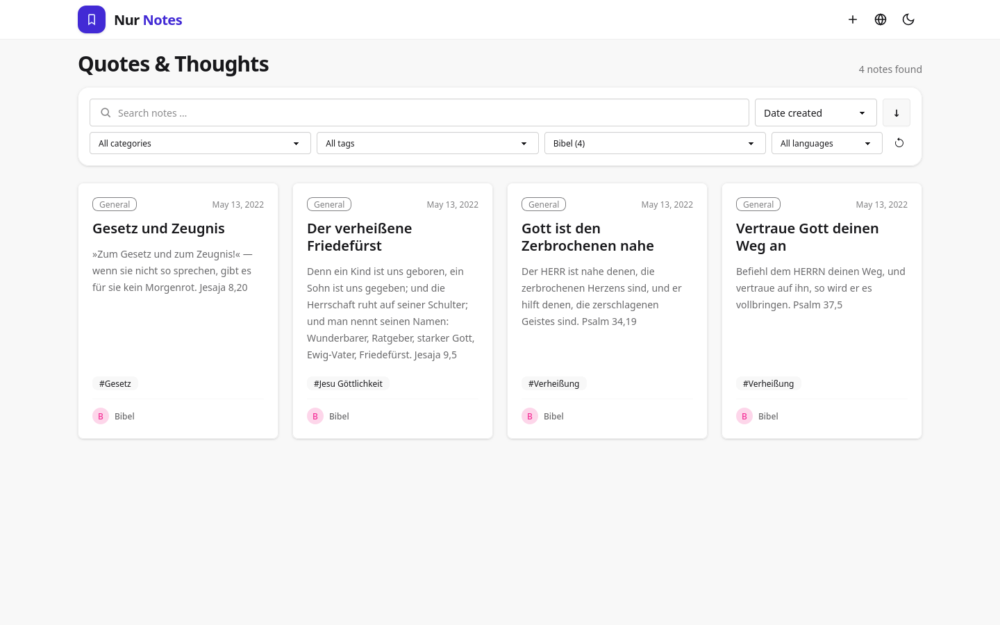
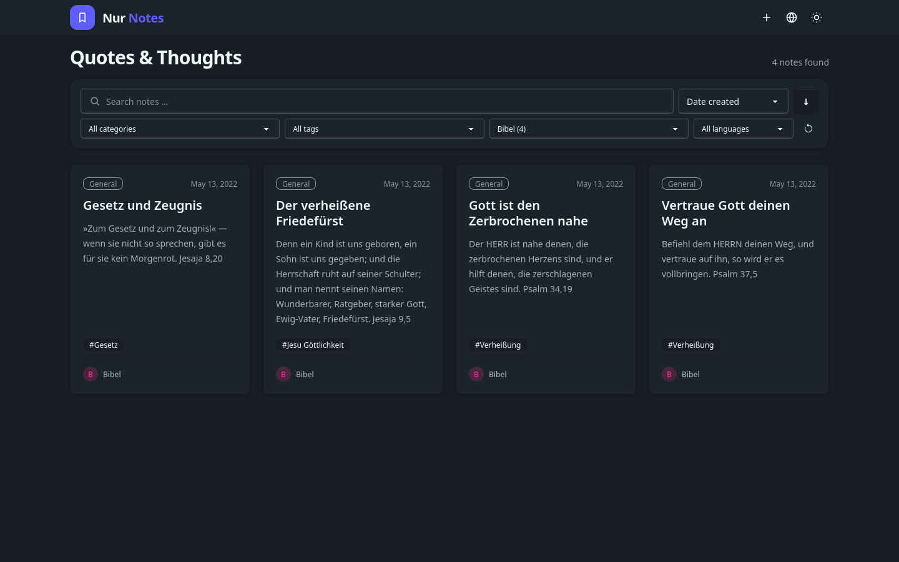

# nur-notes

A responsive card-based frontend for [nur-cms](https://github.com/jb-alvarado/nur-cms), built with Vue 3, Tailwind CSS, and DaisyUI. It supports search, filters for tags, categories, authors, and languages, infinite scrolling, light and dark themes, and installation as a PWA. Signed-in CMS users can create and edit notes.

Light theme:



Dark theme:



*Screenshots show notes from nur-cms filtered by `author=bibel`.*

## Requirements

A running [nur-cms](https://github.com/jb-alvarado/nur-cms) instance with a content type whose slug is `note`. For CMS installation and configuration, see the [nur-cms README](https://github.com/jb-alvarado/nur-cms#readme) and its [documentation](https://github.com/jb-alvarado/nur-cms/tree/main/docs), especially the [configuration guide](https://github.com/jb-alvarado/nur-cms/blob/main/docs/configuration.md).

## Run the frontend

From this repository:

```sh
npm install
npm run dev
```

Open <http://127.0.0.1:5757/>. The Vite development server proxies `/api`, `/auth`, `/sse`, and `/uploads` to the CMS at `127.0.0.1:8777`. The frontend requests the CMS API from the same origin by default; in production, serve the built frontend with those paths routed to nur-cms. The frontend is a separate build and is not included in the nur-cms binary.

## Build and checks

```sh
npm run type-check
npm run lint
npm run build
```

The production files are written to `dist/`.
